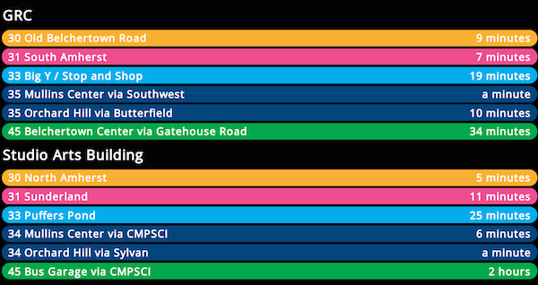

This application uses [Avail Technologies'][avail] InfoPoint API endpoints to
show departures for specified stops. It was written by [UMass Transit][umts] IT
for use by the [Pioneer Valley Transit Authority][pvta]. The application is
intended for use on monitors and kiosks located at bus stops.



Deployment
==========
This application is entirely client-side, which means that all you need to
deploy it is a web browser capable of being full-screen. GitHub pages is enabled
on the `master` branch of this repository, which means that you can use it by
simply pointing a browser at http://umts.github.io/BusInfoBoard/. Alternatively,
you can host a copy of the code on any web server capable of serving static
files, or even keep a copy of the code as a local file on your kiosk device.

If you would like to use this site with an Avail transit agency other than PVTA,
you will need to edit the `url` in `main.js` to point to your installation of
InfoPoint.

Configuration
=============
Configuration can be done in two ways: by using query strings in the request
url, or by passing a URL where a configuration JSON file lives. If both methods
are used, query string parameters take precedence.

Query String
------------
- `?title=Bus%20Departures` specifies what title should appear at the top of
  the page, if any.
- `?stops=1+2+3` specifies the list of stops by stop id that you would
  like to see information for. The list is plus (`+`) separated.
- `?routes=B43+30` specifies a subset of routes that you would like to
  see information for. This list is also plus (`+`) separated. If no
  routes are specified, then the page displays all routes.
- `?excluded_trips=Bus%20Garage%20via%20Mass%20Ave+Bus%20Garage%20via%20Compsci`
  specifies a subset of `InternetServiceDesc`s that you would not like to see
  information for. This list is also plus (`+`) separated.
- `?sort=time` changes the order that departures are displayed to be by
  departure time. The default is alphabetically by `ShortName`.
- `?interval=30` specifies how frequently to update the display in
  seconds. The default value is 30 seconds.
- `?work_day_start=4` specifies the hour on which the agency's service
  day changes. This is mostly used in dealing with DST changes, and as
  such, you should avoid hours less than 3.  The default is 4.
- `?start_animation=someAnimation` specifies which animation to use when
  adding route times to the page. You can choose from any of the animation
  names available in [animate.css][animate], but it should probably be an
  "entrance" animation; the default animation is `fadeInDown`.
- `?end_animation=someAnimation` specifies which animation to use when
  clearing the display for refresh. This should probably be an "exit"
  animation; the default is `fadeOut`.
- `?alternate_interval=3` specified how frequently the display should alternate
  between displaying the time of a departure, and the relative time
  (e.g. 3 min). The minimum value is 1 second, and the maximum value is half
  the refresh interval. The default value is 3 seconds.
- `disable_alternation=true` allows you to disable the alternation between
  absolute and relative time.

Config URL
----------
All of the same parameters can be passed via config URL. Set the `config_url`
variable in `main.js` to point to a JSON-formatted configuration file. For
example:

```json
{
  "routes": ["B43", "30"],
  "interval": 30000,
  "excluded_trips": ["Bus Garage via Mass Ave", "Bus Garage via Compsci"]
}
```

Examples
--------
All 7 Holyoke Transportation Center Gates:

http://umts.github.io/BusInfoBoard/?stops=9098+9097+9096+9089+9088+9087+9086

UMass campus shuttle at ILC and Morrill:

http://umts.github.io/BusInfoBoard/?stops=64+63&routes=34+35

All buses at the Academy of Music, ordered by departure time:

http://umts.github.io/BusInfoBoard/?stops=261&sort=time

Haigis Mall with more "flair" :trollface::

http://umts.github.io/BusInfoBoard/?stops=73&interval=5&start_animation=bounceIn&end_animation=rotateOutUpRight

[avail]: http://www.availtec.com/
[umts]: http://www.umass.edu/transit/
[pvta]: http://www.pvta.com/
[animate]: http://daneden.github.io/animate.css/
